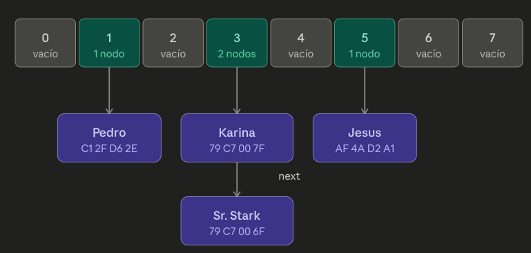

# Sistema de control de acceso RFID en Arduino usando hash table

Almacena y realiza busquedas de UID's (identificadores unicos de RFID), utilizando una hash table con separate chaining.

## Motivación:

Este proyecto busca poner en practica la estructura de datos ´hash table´ y las ventajas que ofrece con respecto a los arrays y linked list. 

## Funcionamiento:



- `hashing()`: Toma un array de bytes definido y realiza una suma ponderada, para disminuir la posibilidad que estos sean muy similares se multiplica por la posicion en la que se encuentre `i`. No es criptografica, es deterministica y rápida.

    ```c
    unsigned int hashing(byte key[ARRAY_SIZE])
    {
    int acumulado = 0;
    unsigned int hashcode = 0;
    for (int i = 0; i < ARRAY_SIZE; i++)
    {
        acumulado += key[i] * (i+1);
    }

    hashcode = acumulado % HASH_SIZE;
    return hashcode;
    }
    ```
- No utiliza open addressing con linear search o rehashing para evitar `clustering` o mayor complejidad. El chaining con linked list es más simple de implementar con memoria dinamica en Arduino.

- Complejidad: O(1) para search, O(n) en el peor caso, si hay muchas colisiones en el mismo bucket.


## Hardware / setup:

- Arduino Uno or Nano
- RFID RC522 module x1
- RFID cards or tags x2 (minimum)
- 220Ω resistors x2
- Breadboard + jumper wires

## Instalación y uso:

### Librerias:

- `SPI.h` 
- `MFRC522.h`

### Agregar nuevos usuarios:

Añade o modifica un usuario. Inicia por el UID, asinando un array de bytes (correcto o incorrecto). Luego edita el `username`.

```c
  const byte key[ARRAY_SIZE] = {0x00, 0x00, 0x00, 0x00};
  users[0].username = "nombre";
```

## Limitaciones conocidas:

- No se realiza free() en varios puntos, pudiendo ocasionar memory leaks (fugas de memoria).
- Tamaño de hash table fijo, sin un load factor para aumentar de tamaño.